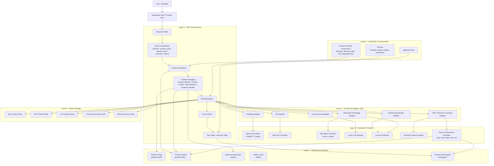
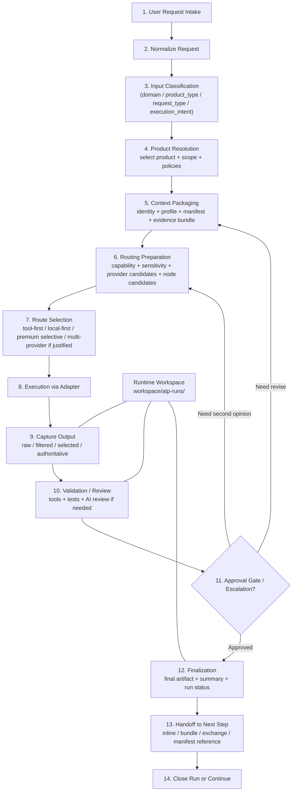
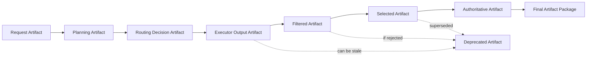

# ATP – Sơ đồ phân lớp và sơ đồ flow trực quan

Tài liệu này cung cấp 2 sơ đồ trực quan để dùng trong tài liệu kiến trúc ATP:

- **Sơ đồ phân lớp (Layered Architecture Diagram)**
- **Sơ đồ flow orchestration (Execution Flow Diagram)**

Các sơ đồ được viết bằng **Mermaid** để dễ nhúng vào markdown/docs về sau.

---

## 1. Sơ đồ phân lớp ATP

---

## 2. Sơ đồ flow orchestration ATP

---

## 3. Sơ đồ flow chi tiết hơn theo artifact lifecycle

---

## 4. Gợi ý cách dùng trong docs ATP

- Dùng **Sơ đồ phân lớp ATP** ở phần mở đầu tài liệu kiến trúc tổng thể.
- Dùng **Sơ đồ flow orchestration ATP** ở phần mô tả execution model.
- Dùng **Sơ đồ artifact lifecycle** ở phần artifact-centric workflow, handoff và runtime workspace.

---

## 5. Ghi chú

Nếu hệ thống docs hoặc markdown renderer của anh chưa hỗ trợ Mermaid, có thể dùng chính các sơ đồ này làm nguồn để chuyển tiếp thành:
- PNG
- SVG
- draw.io
- hoặc sơ đồ trình chiếu.
